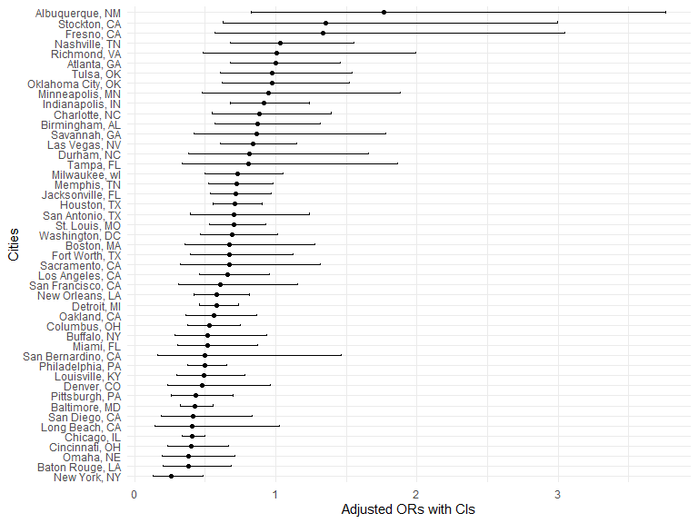
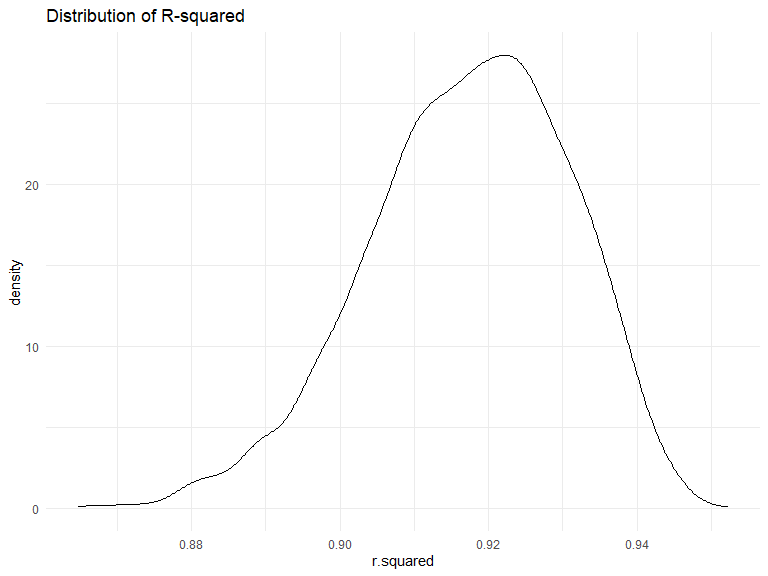
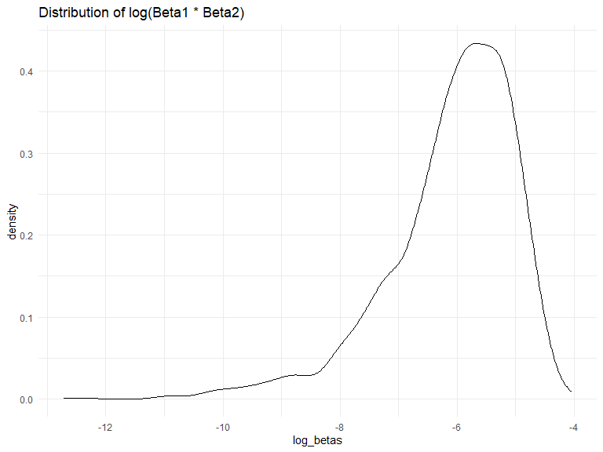
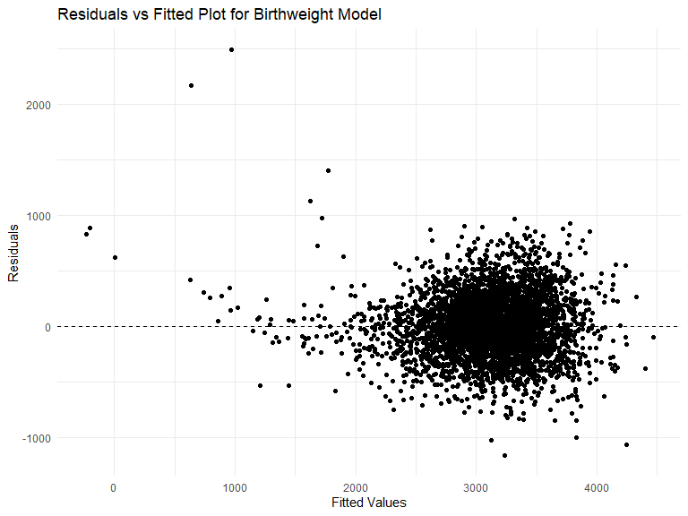
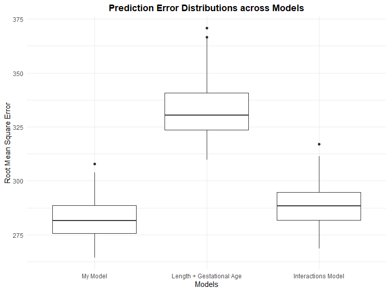

p8105_hw6
================
Zhezheng Jin
2023-11-29

## Problem 1

#### Data import

``` r
homicide <- read_csv("./data_file/homicide-data.csv")

homicide
```

    ## # A tibble: 52,179 × 12
    ##    uid        reported_date victim_last  victim_first victim_race victim_age
    ##    <chr>              <dbl> <chr>        <chr>        <chr>       <chr>     
    ##  1 Alb-000001      20100504 GARCIA       JUAN         Hispanic    78        
    ##  2 Alb-000002      20100216 MONTOYA      CAMERON      Hispanic    17        
    ##  3 Alb-000003      20100601 SATTERFIELD  VIVIANA      White       15        
    ##  4 Alb-000004      20100101 MENDIOLA     CARLOS       Hispanic    32        
    ##  5 Alb-000005      20100102 MULA         VIVIAN       White       72        
    ##  6 Alb-000006      20100126 BOOK         GERALDINE    White       91        
    ##  7 Alb-000007      20100127 MALDONADO    DAVID        Hispanic    52        
    ##  8 Alb-000008      20100127 MALDONADO    CONNIE       Hispanic    52        
    ##  9 Alb-000009      20100130 MARTIN-LEYVA GUSTAVO      White       56        
    ## 10 Alb-000010      20100210 HERRERA      ISRAEL       Hispanic    43        
    ## # ℹ 52,169 more rows
    ## # ℹ 6 more variables: victim_sex <chr>, city <chr>, state <chr>, lat <dbl>,
    ## #   lon <dbl>, disposition <chr>

#### Data wrangling

``` r
homicide_clean <- homicide %>%
  # Create city_state variable
  mutate(city_state = paste(city, state, sep = ", ")) %>%
  # Omit specified cities
  filter(!(city_state %in% c("Dallas, TX", "Phoenix, AZ", "Kansas City, MO", "Tulsa, AL"))) %>%
  # Limit analysis to white or black victim race
  filter(victim_race %in% c("White", "Black")) %>%
  # Create is_solved binary variable
  mutate(is_solved = if_else(disposition == "Closed by arrest", 1, 0)) %>%
  # Ensure victim_age is numeric
  mutate(victim_age = as.numeric(victim_age))

homicide_clean
```

    ## # A tibble: 39,693 × 14
    ##    uid        reported_date victim_last  victim_first victim_race victim_age
    ##    <chr>              <dbl> <chr>        <chr>        <chr>            <dbl>
    ##  1 Alb-000003      20100601 SATTERFIELD  VIVIANA      White               15
    ##  2 Alb-000005      20100102 MULA         VIVIAN       White               72
    ##  3 Alb-000006      20100126 BOOK         GERALDINE    White               91
    ##  4 Alb-000009      20100130 MARTIN-LEYVA GUSTAVO      White               56
    ##  5 Alb-000012      20100218 LUJAN        KEVIN        White               NA
    ##  6 Alb-000016      20100308 GRAY         STEFANIA     White               43
    ##  7 Alb-000018      20100323 DAVID        LARRY        White               52
    ##  8 Alb-000019      20100402 BRITO        ELIZABETH    White               22
    ##  9 Alb-000021      20100423 KING         TEVION       Black               15
    ## 10 Alb-000022      20100423 BOYKIN       CEDRIC       Black               25
    ## # ℹ 39,683 more rows
    ## # ℹ 8 more variables: victim_sex <chr>, city <chr>, state <chr>, lat <dbl>,
    ## #   lon <dbl>, disposition <chr>, city_state <chr>, is_solved <dbl>

#### Logistic regression analysis for Baltimore

``` r
# Step 1: Filter data for Baltimore, MD
baltimore_data <- homicide_clean %>%
  filter(city_state == "Baltimore, MD")

# Step 2: Prepare data (ensure factors and binary outcome)
baltimore_data <- baltimore_data %>%
  mutate(victim_sex = as.factor(victim_sex),
         victim_race = as.factor(victim_race),
         is_solved = factor(is_solved, levels = c(0, 1)))

# Step 3: Fit logistic regression model
model <- glm(is_solved ~ victim_age + victim_sex + victim_race, 
             data = baltimore_data, family = binomial())

# Step 4: Apply broom::tidy to the model object
model_tidy <- tidy(model)

# Displaying the tidy model summary
print(model_tidy)
```

    ## # A tibble: 4 × 5
    ##   term             estimate std.error statistic  p.value
    ##   <chr>               <dbl>     <dbl>     <dbl>    <dbl>
    ## 1 (Intercept)       0.310     0.171        1.81 7.04e- 2
    ## 2 victim_age       -0.00673   0.00332     -2.02 4.30e- 2
    ## 3 victim_sexMale   -0.854     0.138       -6.18 6.26e-10
    ## 4 victim_raceWhite  0.842     0.175        4.82 1.45e- 6

``` r
# Step 5: Calculate adjusted odds ratios 
adjusted_or <- exp(coef(model)["victim_sexMale"])  # For Male vs Female comparison
CI <- confint(model)  # Default confidence interval
```

    ## Waiting for profiling to be done...

``` r
CI_adjusted_or <- exp(CI["victim_sexMale", ])

# Displaying the adjusted odds ratio and its confidence interval
adjusted_or
```

    ## victim_sexMale 
    ##      0.4255117

``` r
CI_adjusted_or
```

    ##     2.5 %    97.5 % 
    ## 0.3241908 0.5575508

The adjusted odds ratio of 0.426 suggests that, in Baltimore, MD, the
odds of solving a homicide for male victims are 0.426 times the the odds
of solving a homicide for female victims, when controlling for other
factors. We are 95% confident that this true odds ratio lies between
0.324 and 0.558. The confidence interval reinforces this conclusion and
indicates a statistically significant difference, as it does not include
1.

#### GLM analysis for each city

``` r
# Step 1 & 2: Group by city and nest data
nested_data <- homicide_clean %>%
  group_by(city_state) %>%
  nest()

# Step 3: Fit logistic regression model and tidy with confidence intervals for each city
nested_data <- nested_data %>%
  mutate(model = map(data, ~glm(is_solved ~ victim_age + victim_sex + victim_race, 
                                data = .x, family = binomial())),
         tidied = map(model, ~tidy(.x, conf.int = TRUE)))

# Step 4: Extract coefficients for `victim_sexMale`
nested_data <- nested_data %>%
  mutate(ORs = map(tidied, ~filter(.x, term == "victim_sexMale") %>%
                     mutate(OR = exp(estimate),
                            CI_lower = exp(conf.low),
                            CI_upper = exp(conf.high))))

# Step 5: Unnest and organize results
GLM_results <- nested_data %>%
  select(city_state, ORs) %>%
  unnest(ORs) %>%
  select(city_state, OR, CI_lower, CI_upper)

GLM_results
```

    ## # A tibble: 47 × 4
    ## # Groups:   city_state [47]
    ##    city_state         OR CI_lower CI_upper
    ##    <chr>           <dbl>    <dbl>    <dbl>
    ##  1 Albuquerque, NM 1.77     0.825    3.76 
    ##  2 Atlanta, GA     1.00     0.680    1.46 
    ##  3 Baltimore, MD   0.426    0.324    0.558
    ##  4 Baton Rouge, LA 0.381    0.204    0.684
    ##  5 Birmingham, AL  0.870    0.571    1.31 
    ##  6 Boston, MA      0.674    0.353    1.28 
    ##  7 Buffalo, NY     0.521    0.288    0.936
    ##  8 Charlotte, NC   0.884    0.551    1.39 
    ##  9 Chicago, IL     0.410    0.336    0.501
    ## 10 Cincinnati, OH  0.400    0.231    0.667
    ## # ℹ 37 more rows

#### Plot: GLM analysis for each city

``` r
GLM_results <- GLM_results %>%
  arrange(OR)

GLM_plot <- ggplot(GLM_results, aes(x = reorder(city_state, OR), y = OR)) +
  geom_point() +  
  geom_errorbar(aes(ymin = CI_lower, ymax = CI_upper), width = 0.2) +  
  coord_flip() +
  labs(x = "Cities",
       y = "Adjusted ORs with CIs") +
  theme_minimal()

GLM_plot
```



A noticeable trend in this plot is that most cities have ORs less than
1, suggesting that across these cities, homicides with male victims are
generally less likely to be solved than those with female victims.
Moreover, the CIs for the majority of cities cross the OR of 1,
indicating that for many cities, the difference in the likelihood of
solving homicides with male versus female victims is not statistically
significant. Some cities have wide CIs, reflecting greater uncertainty
in their estimates, while others have narrower CIs, indicating more
precise estimates.

## Problem 2

#### Weather data

``` r
weather_df = 
  rnoaa::meteo_pull_monitors(
    c("USW00094728"),
    var = c("PRCP", "TMIN", "TMAX"), 
    date_min = "2022-01-01",
    date_max = "2022-12-31") |>
  mutate(
    name = recode(id, USW00094728 = "CentralPark_NY"),
    tmin = tmin / 10,
    tmax = tmax / 10) |>
  select(name, id, everything())
```

    ## using cached file: C:\Users\11350\AppData\Local/R/cache/R/rnoaa/noaa_ghcnd/USW00094728.dly

    ## date created (size, mb): 2023-09-28 10:25:36.441147 (8.541)

    ## file min/max dates: 1869-01-01 / 2023-09-30

#### Bootstrap analysis for log_betas and r_squared

``` r
fit0 <- lm(tmax ~ tmin + prcp, data = weather_df)
set.seed(123)
boot_sample = function(df) {
  sample_frac(df, replace = TRUE)
}

boot_straps = 
  data_frame(
    strap_number = 1:5000,
    strap_sample = rerun(5000, boot_sample(weather_df))
  )

bootstrap_results = 
  boot_straps %>% 
  mutate(
    models = map(strap_sample, ~lm(tmax ~ tmin + prcp, data = .x) ),
    results = map(models, tidy)) %>% 
  select(-strap_sample, -models) %>% 
  unnest(results) 

log_betas <-  
  bootstrap_results %>%
  group_by(strap_number) %>%
  summarise(log_betas = log(estimate[2] * estimate[3])) %>%
  select(log_betas, strap_number)

bootstrap_results2 <- 
  boot_straps %>% 
  mutate(
    models = map(strap_sample, ~lm(tmax ~ tmin + prcp, data = .x) ),
    results = map(models, glance)) %>% 
  select(-strap_sample, -models) %>% 
  unnest(results) 

r_squared <- 
  bootstrap_results2 %>%
  select(r.squared, strap_number)
```

#### Fitting density plots of two estimates

``` r
ggplot(r_squared, aes(x = r.squared)) + 
  geom_density() +
  labs(title = "Distribution of R-squared") +
  theme_minimal()
```



``` r
ggplot(log_betas, aes(x = log_betas)) + 
  geom_density() +
  labs(title = "Distribution of log(Beta1 * Beta2)") +
  theme_minimal()
```



``` r
r_squared_sd <-
  r_squared %>%
  summarise(r_squared_sd = sd(r.squared)) %>%
  pull(r_squared_sd)

r_squared_mean <-
  r_squared %>%
  summarise(r_squared_mean = mean(r.squared)) %>%
  pull(r_squared_mean)

log_betas_sd <- 
  log_betas %>%
  summarise(log_betas_sd = sd(as.numeric(log_betas),na.rm = TRUE)) %>%
  pull(log_betas_sd)

log_betas_mean <- 
  log_betas %>% 
  summarise(log_betas_mean = mean(as.numeric(log_betas), na.rm = TRUE)) %>%
  pull(log_betas_mean)
```

The $\hat{r}^2$ distribution is approximately normal, centered around a
mean of **0.9173027** with a narrow spread (SD = **0.0136242**),
reflecting a consistent model fit across bootstrap samples. In contrast,
the distribution for $log(\beta_{1} * \beta_{2})$ is left-skewed with a
mean of **-6.1059669** and a wider spread (SD = **1.1136377**),
indicating a tendency for the product of coefficients to be less than
one and a more variable interaction effect between the predictors across
samples.

#### Confidence intervals for log(β<sup>1∗β</sup>2)

``` r
CI_result <-
  log_betas %>%
  summarize(ci_lower = quantile(log_betas, 0.025, na.rm = TRUE),
            ci_upper = quantile(log_betas, 0.975, na.rm = TRUE))

CI_result_lower <- CI_result %>% pull(ci_lower)
CI_result_upper <- CI_result %>% pull(ci_upper)
```

95% Confidence Interval of $log(\beta_{1} * \beta_{2})$:
(**-9.0632139**, **-4.6192674**)

#### Confidence intervals for r^2

``` r
CI_result2 <-
  r_squared %>%
  summarize(ci_lower = quantile(r.squared, 0.025),
            ci_upper = quantile(r.squared, 0.975)) 

CI_result_lower2 <- CI_result2 %>% pull(ci_lower)
CI_result_upper2 <- CI_result2 %>% pull(ci_upper)
```

95% Confidence Interval of $\hat{r}^2$ : (**0.8882079**, **0.9402552**)

## Problem 3

#### Data Import

``` r
birthweight_data <- read_csv("./data_file/birthweight.csv")
```

    ## Rows: 4342 Columns: 20
    ## ── Column specification ────────────────────────────────────────────────────────
    ## Delimiter: ","
    ## dbl (20): babysex, bhead, blength, bwt, delwt, fincome, frace, gaweeks, malf...
    ## 
    ## ℹ Use `spec()` to retrieve the full column specification for this data.
    ## ℹ Specify the column types or set `show_col_types = FALSE` to quiet this message.

#### Tidying and wrangling the data

``` r
cleaned_birthweight_data <-
  birthweight_data %>% 
  clean_names() %>%
  mutate(across(.cols = c(babysex, frace, malform, mrace), as.factor)) %>%
  mutate(babysex = ifelse(babysex == "1", "male","female"),
         malform = ifelse(malform == "0", "absent","present"),
         frace = recode(frace, "1" = "White", "2" = "Black", "3" = "Asian", 
                        "4" = "Puerto Rican", "8" = "Other", "9" = "Unknown"),
         mrace = recode(mrace, "1" = "White", "2" = "Black", 
                        "3" = "Asian", "4" = "Puerto Rican", "8" = "Other")
         )
```

#### Checking Missing Values

``` r
skimr::skim(cleaned_birthweight_data)
```

|                                                  |                          |
|:-------------------------------------------------|:-------------------------|
| Name                                             | cleaned_birthweight_data |
| Number of rows                                   | 4342                     |
| Number of columns                                | 20                       |
| \_\_\_\_\_\_\_\_\_\_\_\_\_\_\_\_\_\_\_\_\_\_\_   |                          |
| Column type frequency:                           |                          |
| character                                        | 2                        |
| factor                                           | 2                        |
| numeric                                          | 16                       |
| \_\_\_\_\_\_\_\_\_\_\_\_\_\_\_\_\_\_\_\_\_\_\_\_ |                          |
| Group variables                                  | None                     |

Data summary

**Variable type: character**

| skim_variable | n_missing | complete_rate | min | max | empty | n_unique | whitespace |
|:--------------|----------:|--------------:|----:|----:|------:|---------:|-----------:|
| babysex       |         0 |             1 |   4 |   6 |     0 |        2 |          0 |
| malform       |         0 |             1 |   6 |   7 |     0 |        2 |          0 |

**Variable type: factor**

| skim_variable | n_missing | complete_rate | ordered | n_unique | top_counts                              |
|:--------------|----------:|--------------:|:--------|---------:|:----------------------------------------|
| frace         |         0 |             1 | FALSE   |        5 | Whi: 2123, Bla: 1911, Pue: 248, Asi: 46 |
| mrace         |         0 |             1 | FALSE   |        4 | Whi: 2147, Bla: 1909, Pue: 243, Asi: 43 |

**Variable type: numeric**

| skim_variable | n_missing | complete_rate |    mean |     sd |     p0 |     p25 |     p50 |     p75 |   p100 | hist  |
|:--------------|----------:|--------------:|--------:|-------:|-------:|--------:|--------:|--------:|-------:|:------|
| bhead         |         0 |             1 |   33.65 |   1.62 |  21.00 |   33.00 |   34.00 |   35.00 |   41.0 | ▁▁▆▇▁ |
| blength       |         0 |             1 |   49.75 |   2.72 |  20.00 |   48.00 |   50.00 |   51.00 |   63.0 | ▁▁▁▇▁ |
| bwt           |         0 |             1 | 3114.40 | 512.15 | 595.00 | 2807.00 | 3132.50 | 3459.00 | 4791.0 | ▁▁▇▇▁ |
| delwt         |         0 |             1 |  145.57 |  22.21 |  86.00 |  131.00 |  143.00 |  157.00 |  334.0 | ▅▇▁▁▁ |
| fincome       |         0 |             1 |   44.11 |  25.98 |   0.00 |   25.00 |   35.00 |   65.00 |   96.0 | ▃▇▅▂▃ |
| gaweeks       |         0 |             1 |   39.43 |   3.15 |  17.70 |   38.30 |   39.90 |   41.10 |   51.3 | ▁▁▂▇▁ |
| menarche      |         0 |             1 |   12.51 |   1.48 |   0.00 |   12.00 |   12.00 |   13.00 |   19.0 | ▁▁▂▇▁ |
| mheight       |         0 |             1 |   63.49 |   2.66 |  48.00 |   62.00 |   63.00 |   65.00 |   77.0 | ▁▁▇▂▁ |
| momage        |         0 |             1 |   20.30 |   3.88 |  12.00 |   18.00 |   20.00 |   22.00 |   44.0 | ▅▇▂▁▁ |
| parity        |         0 |             1 |    0.00 |   0.10 |   0.00 |    0.00 |    0.00 |    0.00 |    6.0 | ▇▁▁▁▁ |
| pnumlbw       |         0 |             1 |    0.00 |   0.00 |   0.00 |    0.00 |    0.00 |    0.00 |    0.0 | ▁▁▇▁▁ |
| pnumsga       |         0 |             1 |    0.00 |   0.00 |   0.00 |    0.00 |    0.00 |    0.00 |    0.0 | ▁▁▇▁▁ |
| ppbmi         |         0 |             1 |   21.57 |   3.18 |  13.07 |   19.53 |   21.03 |   22.91 |   46.1 | ▃▇▁▁▁ |
| ppwt          |         0 |             1 |  123.49 |  20.16 |  70.00 |  110.00 |  120.00 |  134.00 |  287.0 | ▅▇▁▁▁ |
| smoken        |         0 |             1 |    4.15 |   7.41 |   0.00 |    0.00 |    0.00 |    5.00 |   60.0 | ▇▁▁▁▁ |
| wtgain        |         0 |             1 |   22.08 |  10.94 | -46.00 |   15.00 |   22.00 |   28.00 |   89.0 | ▁▁▇▁▁ |

There is no missing data. The dimension of the birthweight data is 4342
x 20. The 20 variables include: *babysex, bhead, blength, bwt, delwt,
fincome, frace, gaweeks, malform, menarche, mheight, momage, mrace,
parity, pnumlbw, pnumsga, ppbmi, ppwt, smoken, wtgain.*

#### \# Fit the initial model and Check the model summary

``` r
initial_model <- lm(bwt ~ ., data = cleaned_birthweight_data)
summary(initial_model)
```

    ## 
    ## Call:
    ## lm(formula = bwt ~ ., data = cleaned_birthweight_data)
    ## 
    ## Residuals:
    ##      Min       1Q   Median       3Q      Max 
    ## -1097.68  -184.86    -3.33   173.09  2344.15 
    ## 
    ## Coefficients: (3 not defined because of singularities)
    ##                     Estimate Std. Error t value Pr(>|t|)    
    ## (Intercept)       -6236.6841   660.1884  -9.447  < 2e-16 ***
    ## babysexmale         -28.7073     8.4652  -3.391 0.000702 ***
    ## bhead               130.7781     3.4523  37.881  < 2e-16 ***
    ## blength              74.9536     2.0217  37.075  < 2e-16 ***
    ## delwt                 4.1007     0.3948  10.386  < 2e-16 ***
    ## fincome               0.2898     0.1795   1.614 0.106551    
    ## fraceBlack           14.3313    46.1501   0.311 0.756168    
    ## fraceAsian           21.2361    69.2960   0.306 0.759273    
    ## fracePuerto Rican   -46.9962    44.6782  -1.052 0.292912    
    ## fraceOther            4.2969    74.0741   0.058 0.953745    
    ## gaweeks              11.5494     1.4654   7.882 4.06e-15 ***
    ## malformpresent        9.7650    70.6259   0.138 0.890039    
    ## menarche             -3.5508     2.8951  -1.226 0.220083    
    ## mheight               9.7874    10.3116   0.949 0.342588    
    ## momage                0.7593     1.2221   0.621 0.534418    
    ## mraceBlack         -151.4354    46.0453  -3.289 0.001014 ** 
    ## mraceAsian          -91.3866    71.9190  -1.271 0.203908    
    ## mracePuerto Rican   -56.4787    45.1369  -1.251 0.210901    
    ## parity               95.5411    40.4793   2.360 0.018307 *  
    ## pnumlbw                   NA         NA      NA       NA    
    ## pnumsga                   NA         NA      NA       NA    
    ## ppbmi                 4.3538    14.8913   0.292 0.770017    
    ## ppwt                 -3.4716     2.6121  -1.329 0.183913    
    ## smoken               -4.8544     0.5871  -8.269  < 2e-16 ***
    ## wtgain                    NA         NA      NA       NA    
    ## ---
    ## Signif. codes:  0 '***' 0.001 '**' 0.01 '*' 0.05 '.' 0.1 ' ' 1
    ## 
    ## Residual standard error: 272.5 on 4320 degrees of freedom
    ## Multiple R-squared:  0.7183, Adjusted R-squared:  0.717 
    ## F-statistic: 524.6 on 21 and 4320 DF,  p-value: < 2.2e-16

After fitting the initial model, the coefficients for babysex, bhead,
blength, delwt, fincome, gaweeks, momage, mrace, parity, and smoken are
significant at the 0.05 level. The NAs for pnumlbw, pnumsga, and wtgain
suggest that there are issues with these variables in the model, such as
multicollinearity.

Based on the provided coefficients and their p-values, I consider only
the statistically significant continuous predictors for fitting a
simplified linear model for birthweight.

#### Proposing the Regression Model for Birthweight

``` r
model_fit <- lm(bwt ~ bhead + blength + delwt + gaweeks + smoken, data = cleaned_birthweight_data)

summary(model_fit) %>% 
  tidy() %>%
  select(term, estimate, p.value)
```

    ## # A tibble: 6 × 3
    ##   term        estimate   p.value
    ##   <chr>          <dbl>     <dbl>
    ## 1 (Intercept) -6223.   0        
    ## 2 bhead         135.   1.92e-281
    ## 3 blength        78.7  4.51e-272
    ## 4 delwt           2.09 2.20e- 25
    ## 5 gaweeks        14.6  2.74e- 22
    ## 6 smoken         -2.26 1.04e-  4

``` r
summary(model_fit) %>% 
  glance()
```

    ## # A tibble: 1 × 8
    ##   r.squared adj.r.squared sigma statistic p.value    df df.residual  nobs
    ##       <dbl>         <dbl> <dbl>     <dbl>   <dbl> <dbl>       <int> <dbl>
    ## 1     0.696         0.696  282.     1990.       0     5        4336  4342

Based on the statistical summary, the fitted linear regression model
with significant continuous variables—baby’s head circumference, length
at birth, mother’s weight at delivery, gestational age, and smoking
during pregnancy—explains 69.6% of the variability in birthweight
(R-squared = 0.696). All variables are highly significant with strong
associations to birthweight.

#### Model Checking: Residuals Plot

``` r
cleaned_birthweight_data %>%
  add_predictions(model_fit) %>%
  add_residuals(model_fit) %>%
  ggplot(aes(x = pred, y = resid)) +
  geom_point() +
  geom_hline(yintercept = 0, linetype = "dashed") +
  labs(x = "Fitted Values", y = "Residuals", title = "Residuals vs Fitted Plot for Birthweight Model")
```



The “Residuals vs Fitted Plot” for the birthweight model indicates that
the residuals are mostly randomly dispersed around the horizontal line
at zero, which is good for homoscedasticity and linearity assumptions.
However, the presence of a few outliers, particularly for higher fitted
values, suggests that there might be some unusually large or small
birthweights that the model does not predict well. There’s no clear
pattern indicating non-linearity or heteroscedasticity.

#### Computing rmse of models through cross validaiton

``` r
set.seed(77)

cv_dataset <-
  cleaned_birthweight_data %>% 
  crossv_mc(n = 100,test = 0.2)
  

cv_df <- 
  cv_dataset %>%
   mutate(
    train = map(train, as_tibble),
    test = map(test, as_tibble))

cv_df <-
  cv_df %>%
    mutate(
    my_model  = map(train, ~lm(bwt ~ bhead + blength + delwt + gaweeks + smoken, data = .x)),
    model_length_gaweeks = map(train, ~lm(bwt ~ blength + gaweeks, data = .x)),
    model_interactions  = map(train, ~lm(bwt ~ (bhead + blength + babysex)^3, data = .x))
    ) %>%
   mutate(
    rmse_my_model = map2_dbl(my_model, test, ~rmse(model = .x, data = .y)),
    rmse_length_gaweeks = map2_dbl(model_length_gaweeks, test, ~rmse(model = .x, data = .y)),
    rmse_interactions = map2_dbl(model_interactions, test, ~rmse(model = .x, data = .y))
   )
```

#### Fitting the distribution of rmse of the models

``` r
cv_df %>% 
  select(starts_with("rmse")) %>% 
  pivot_longer(
    everything(),
    names_to = "model", 
    values_to = "rmse",
    names_prefix = "rmse_") %>% 
  mutate(model = fct_inorder(model)) %>% 
  ggplot(aes(x = model, y = rmse)) + 
  geom_boxplot() +
  labs(title = 
  "Prediction Error Distributions across Models", 
       x = "Models", y = "Root Mean Square Error")  +
  scale_x_discrete(
    labels = c("My Model", "Length + Gestational Age", "Interactions Model")) +
  theme(plot.title = element_text(hjust = 0.5, face = "bold"))
```



Here, we are comparing models with respect to the cross-validated
prediction error. By and large, my model seems to have the lowest
prediction error (rmse) and hence is potentially the best model,
followed by the Interactions Model and the Length + Gestational Age
Model when comparing the medians (the line in the middle of the box) and
the overall distribution of the box plots.
